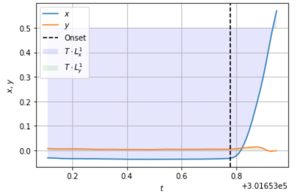

# TiltX

#### Feature extraction from mobile phone motion sensor data

[](https://badge.fury.io/py/tiltx)

This repository implements a method which extracts some of the key features from mobile phone motion sensor data.

At `t=0` a visual stimulus appears on the screen. As the response, a participant (person holding the phone) is required to tilt the phone in a specific direction (left, right, up, or down). Once the roll or picth angle reaches 0.5 radians (`t=T>0`), the movement is completed. `T` is the event time registered by the app. The rotaion along the third axis (yaw) *does not* affect the outcome of the task, hence it is neglected.

The features extracted by TiltX are: reaction time, L1 norms, maximal deviation, number of turning points, and sample entropy.

## Installation  
> Tested with Python 3.6 and 3.7

**anaconda**
```bash
$ conda install -c conda-forge tiltx
```

**pip**
```bash
$ pip install tiltx
```

**Clone from GitHub**
```bash
$ git clone https://github.com/marses/tiltx
$ python setup.py install
```

## Usage
These steps introduce how to use `TiltX`.

### Input data
The `DataGenerator` is a utility class that generates sample datasets. 

```python
from tiltx.data_generator import DataGenerator
t, alpha, beta = DataGenerator.example(1)
```
>  Note: `t`, `alpha`, and `beta` need to be equal length arrays.

### Extract features
The `FeatureExtractor` extracts key features from the data.
```python
from tiltx.feature_extractor import FeatureExtractor
features = FeatureExtractor(t,alpha,beta,RT_method='cumsum',correct='up')
```
> Note: `cumsum` is a method for reaction time detection and `correct` is the direction in which the phone should be tilted in order to successfully complete the task.

```python
print('Reaction time: %.3f'%(features.RT))
print('L1-norm of the triggering axis: %.3f'%(features.L1_x))
print('L1-norm of the remaining (non-triggering) axis: %.3f'%(features.L1_y))

Reaction time: 0.669
L1-norm of the triggering axis: 0.492
L1-norm of the remaining (non-triggering) axis: 0.006
```
### Visualize
By calling `plot()` function in `FeatureExtractor`, we plot the roll and pitch angles from the moment the stimulus appears till the moment when the app registers the move as completed.

```python
features.plot()
```


- `x` is a triggering angle (the one which reaches 0.5 radians first)
- `y` is the remaining (non-triggering) angle
- the shaded regions are proportional to L1 norms
- the black dotted line marks the begining of the reaction

### Documentation
For a tutorial and a brief note on signal features, check out [the notebooks folder](/notebooks).